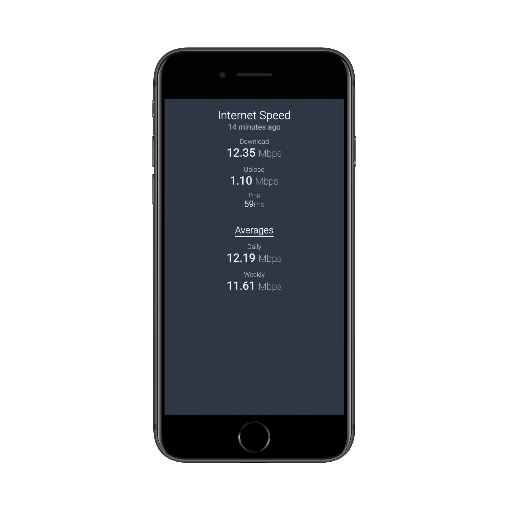
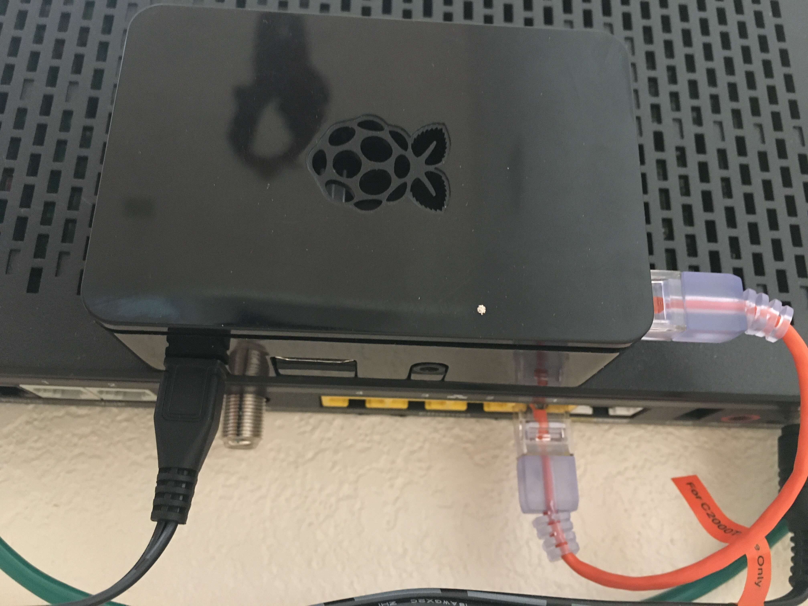

We're going to set up a Raspberry Pi **and** a corresponding web application to host and display the results of our speed test. The Raspberry Pi will be connected to the network and run speed tests with the [speedtest cli](https://www.speedtest.net/apps/cli).

## Overview

The system we are going to set up only consists of 2 parts, a Raspberry Pi for collecting speed test information and a [publicly viewable](https://cabin-internet.herokuapp.com/) web application that the Pi will post the data to.

## What's Needed

- Raspberry Pi
    - Cron installed
    - Python 3 and Pip 3 installed
    - Ethernet cable for a wired to your router OR wifi dongle
- Free [Heroku](https://www.heroku.com/) Account for hosting our app
- Computer (for configuring Heroku and SSH access to your Raspberry Pi)
    - [Git](https://www.atlassian.com/git/tutorials/install-git)
    - [Heroku CLI](https://devcenter.heroku.com/articles/heroku-cli)
    - Optional: [Node](https://nodejs.org/en/download/) and [PostgreSQL](https://www.postgresql.org/download/) if you want to run the Express server locally

## Part 1: Setting up the Raspberry Pi

Make sure you have [SSH setup](https://www.raspberrypi.org/documentation/remote-access/ssh/) on your Pi. Then connect it to your router or network switch and and plug in the power cable.

    